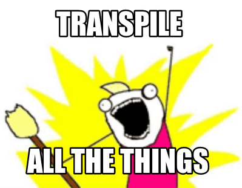

import { Head, Notes, Image, Appear, components as C } from 'mdx-deck'
import { CodeSurfer } from "mdx-deck-code-surfer"

export { default as theme } from './theme'

<Head>
  <title>ECMAScript as an evolving language</title>
</Head>

<Image src="./assets/title.png" size="contain" />

---

# About me

<C.ul>
  <C.li>Lenz Weber (<em>@phry</em> on Twitter, <em>phryneas</em> everywhere else)</C.li>
  <C.li>Developer at </C.li>
  <C.li>Working in professional web development since 15 years</C.li>
  <C.li>In love with the Web, Open Source, Linux and Security</C.li>
  <C.li>Just getting used to conference speaking, so bear with me</C.li>
</C.ul>

---

# Let's get started

---

# ECMAScript? JavaScript!

* **ECMAScript** is the specification behind JavaScript - the baseline every engine should support
* additionally, for front-end development, the **WhatWG DOM Living Standard** describes APIs that can be used for DOM manipulation

---

# A short History of ECMAScript

<C.ul>
  <C.li>1997-1999, ECMAScript 1-3 were released</C.li>
  <Appear>
    <C.li>ECMAScript 4 "Harmony": adding classes, modules, static types, generators, iterators, destructuring etc.  
    <strong>was never released</strong>
    </C.li>
    <C.li>2009, ECMAScript 5: adding strict mode, getters &amp; setters, JSON handling</C.li>
    <C.li>2015, ES6: classes, modules, iterators, for-of-loops, generators, arrow functions, promises, let-bindings etc.</C.li>
    <C.li>2016, ES7: exponention operator, Array.prototype.includes</C.li>
    <C.li>2017, ES8: async/await</C.li>
    <C.li>2018, ES9: rest/spread-parameters</C.li>
  </Appear>
</C.ul>

<Notes>
ES4, Harmony never released 
2009: ES5 
2016: ES6
</Notes>

---

# And a look at the browser

(getting a real history here is almost impossible, so take these examples)

* Element.querySelector() started being supported ~2009
* Element.classList() started being supported ~2012
* **fetch** as a unified API for XHR Requests is supported since 2015-2017 (no IE)

All those things were always possible - but differed from browser to browser.

---

# So... 1999 to 2015...

* Many features were not available cross-browser
* Two types of libraries started surfacing, hiding the browser-specific implementations:
* DOM manipulation (e.g. jquery, mootools), making up for missing DOM manipluation functionality
* Utility (e.g. underscore, lodash, mootools, jquery) to provide ease-of-use where the language was lacking

---

# Then the Standards caught up and browsers started converging

Today, you don't need those libraries any more. Modern browsers support everything we talked about.

Well, except IE11. But for that, we have polyfills. 🎆

---

# All our problems are solved
## ...and they lived happily every after ...
## 👸👸/🤴👸/🤴🤴 -> 🦄 -> 🌈 

---

# Okay, I lied

You can polyfill missing functions, but you can't polyfill unsupported syntax.

---

# So... let's transpile.

The idea behind it:

* Write ES ≥ 6
* Use a transpiler to convert it into ES5 (or even ES3)
* If you want to get fancy: to every browser, ship a form of ECMAScript it is compatible with
* add Polyfills for old browsers where necessary

---

<CodeSurfer
  title="We write this"
  code={require('!raw-loader!./snippets/getMovies.js')}
  showNumbers
/>

---

<CodeSurfer
  title="And IE11 gets this"
  code={require('!raw-loader!./snippets/getMovies.transpiled.js')}
  showNumbers
  steps={[
    { range: [3, 39], notes: "a state machine" },
    { range: [41, 69], notes: "and some glue" },
  ]}
/>"

---

# So...

We have found ways to use modern standards in all browsers (at some cost, but that's unavoidable)

## Why should we stop here?

---

# Languages that extend JavaScript with a type system

---

<CodeSurfer
  title="TypeScript"
  notes="Reads &amp; writes like JavaScript, but has a powerful type system"
  lang="typescript"
  code={require("!raw-loader!./snippets/typescript.example")}
  showNumbers
/>
<Notes>
Doppelpunkt == colon 
Also: flow - MS --- FB
</Notes>

---

# Completely different languages

---

<CodeSurfer
  title="Clojure"
  notes="Can be run in the JVM or transpiled to JavaScript"
  lang="clojure"
  code={require("!raw-loader!./snippets/clojure.example")}
  showNumbers
/>
<Notes>
Lisp-Like
</Notes>

---

<CodeSurfer
  title="Reason"
  notes="OCaml dicalect that transpiles to JavaScript"
  lang="reason"
  code={require("!raw-loader!./snippets/reason.example")}
  showNumbers
/>

<Notes>
Also: Elm, CoffeeScript, PureScript
</Notes>

---

# New syntax to write JavaScript

---

<CodeSurfer
  title="JSX"
  notes="a way of writing JavaScript that looks shockingly like HTML"
  lang="javascript"
  code={require("!raw-loader!./snippets/jsxExample.jsx")}
  showNumbers
/>

---

<CodeSurfer
  title="transpiles to"
  lang="javascript"
  code={require("!raw-loader!./snippets/jsxExample.transpiled.js")}
  showNumbers
/>

---

# Use JSNext
## (or: ECMAScript as an evolving language)

We can also write Syntax that isn't even part of any standard yet!

---

# The Ecma TC39

* The committee that decides on new ECMAScript features
* Accepts minor suggestions as PR/Issue on github
* New feature __Proposals__ are developed in separate GitHub repositories and go through 4 stages

---

# The way of a Proposal

* Document your problem & solution/suggestion
* Discuss it with the community
* Find a TC39 member that will act as __Champion__ for your proposals
* Go through the four stages: __Proposal__, __Draft__, __Candidate__, __Finished__

---

# Using a Proposal today

* Find an interesting proposal at https://github.com/tc39/proposals
* Stage 2 proposals usually come with ready-to-use transpiler plugins
* Just use it
* If you have issues or suggestions: join the discussion 💖

---

<CodeSurfer
  title="an example from the decorator proposal"
  lang="javascript"
  code={require("!raw-loader!./snippets/decorator.example")}
  showNumbers
/>

---

# What this means for Developers:

* You really should be learning ES6 by now
* And then probably some TypeScript or Flow
* Choose your own Adventure with ESNext ;)

---

# Time for Questions & Discussion

---

# By the way...

# We are hiring!

(talk to me)
